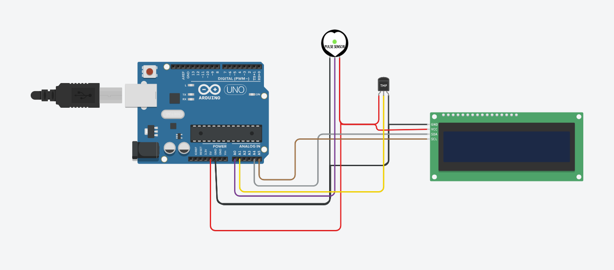
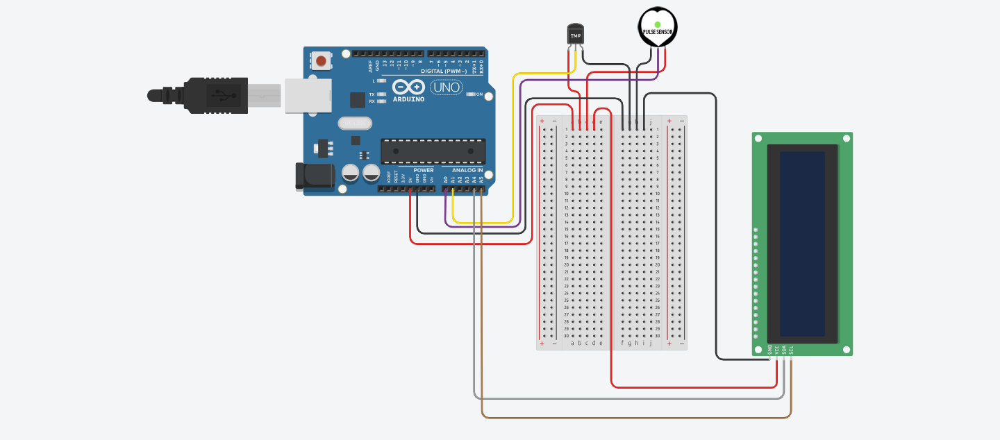

# Medical Device

## In this project we are going to learn how to code and use arduinos by creating a medical device that can read your heart rate and check your temperature.

# Parts List:
* Arduino UNO
* LM35 sensor
* Jumper wires
* Small bread board
* Pulse sensor
* LCD Screen 16x2 with I2C

# Wiring Diagram
## LCD Wiring
* GND to GND
* VCC to 5V
* SDA to A4
* SCL to A5
## Temperature Sensor (LM35) Wiring
* 5V (left node when facing the flat side) to 5V
* VOUT (middle node) to A1
* GND (right node) to GND
## Pulse Sensor
* GND (left node) to GND
* VOUT (middle node) to A0
* 5v (right node to 5V
  
  
# Wiring Diagram with Bread Board
  
  

# Code
```
#define USE_ARDUINO_INTERRUPTS true
#include <Wire.h>
#include <LiquidCrystal_I2C.h>
#include <PulseSensorPlayground.h>     // Includes the PulseSensorPlayground Library

const int PulseWire = 0;       // 'S' Signal pin connected to A0
const int LED13 = 13;          // The on-board Arduino LED
int Threshold = 550;           // Determine which Signal to "count as a beat" and which to ignore
int temPin = A1;                   // Temp sensor pin wire connected to analog pin 1
float RawTemp;                        // holds incoming raw temp data
float TEMP;  

PulseSensorPlayground pulseSensor;

LiquidCrystal_I2C lcd(0x27, 16, 2); // set the LCD address to 0x27 for a 16 chars and 2 line display

void setup()
{
  lcd.init();         // initialize the lcd
  lcd.backlight();  
  
  pulseSensor.analogInput(PulseWire);   
	pulseSensor.blinkOnPulse(LED13);       // Blink on-board LED with heartbeat
	pulseSensor.setThreshold(Threshold);   

	if (pulseSensor.begin()) {
		lcd.setCursor(1, 0);
    lcd.print("Medical Reader");
    lcd.setCursor(4, 1);
    lcd.print("By Anton");
    delay(3000);
    lcd.clear();
	}
}

void loop()
{
  int myBPM = pulseSensor.getBeatsPerMinute(); 
  
  RawTemp = analogRead(temPin);
  float mv = ((RawTemp * 5 )/ 1023);
  float celcius = (mv * 100);
  TEMP = (celcius * (9/5) + 32);

	if (pulseSensor.sawStartOfBeat()) {               // Constantly test to see if a beat happened
    lcd.setCursor(2, 0);
    lcd.print("BPM:");
    lcd.setCursor(10, 0);
    lcd.print(myBPM);
    lcd.setCursor(2, 1);
    lcd.print("Temp:");
    lcd.setCursor(10, 1);
    lcd.print(TEMP);
    delay(3000);
    lcd.clear();
		}

	delay(20);

  
}

```
